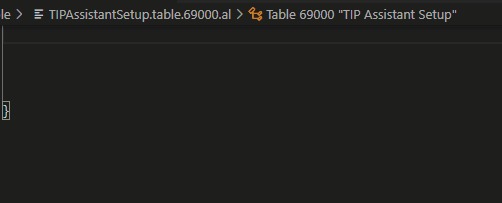
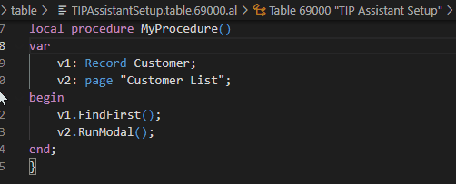

# JALVariableNaming README

This extension eases AL business central variable naming following its own coding rules.

## Features

For example if there is an image subfolder under your extension project workspace:

## Requirements

VSCode and Al language. This last is not a real pre-requisite, but do not make sense use this with other tool.

## Extension Settings

This extension contributes the following settings:

* `CharsFrom` `CharsTo`: Future feature to transform local language chars.
* `ExcludePrefixInRename`: Set true (default) to exclude your prefix from renaming.
* `AppPrefix`: Set here your App prefix to exclude it in renaming (see previous setting).

## Known Issues

Calling out known issues can help limit users opening duplicate issues against your extension.

## Release Notes

### 1.0.0

### 1.0.1

Fixed issue #.

